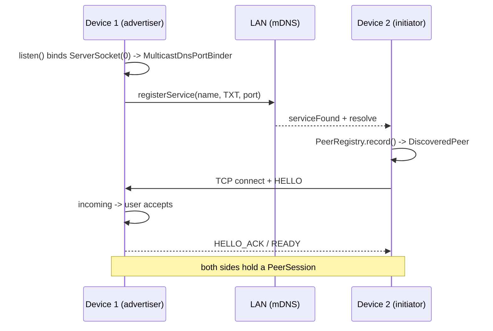

# mDNS connection flow

How two devices find each other and get a session, from advertising to an accepted inbound
connection. Everything below `:net`'s SPI lives in this package; everything above it is
platform-neutral and never sees an Android type.

Roles in this document: **device 1** advertises and accepts, **device 2** discovers and dials.
Device 2 is the handshake *initiator*, device 1 the *responder*.



## 1. Device 1 starts advertising

```
PeerDiscoveryImpl.startAdvertising()          :net  discovery/PeerDiscoveryImpl.kt
  advertisement()                             builds PeerAttributes: did, name, fp,
                                              pmin/pmax, dict, dictv
  Advertiser.advertise(payload)      --SPI--> MulticastDnsAdvertiser
    MulticastDnsPortBinder.value               waits for a listening port
    MulticastDnsAdvertisingService.start()     NsdManager.registerService
```

The published port comes from the transport, not from a constant:
`MulticastDnsTransport.TransportListener.listen()` binds `ServerSocket(0)` and writes
`localPort` into `MulticastDnsPortBinder`.

**Ordering matters.** Until `ConnectionManager.incoming` is collected, no listener runs, no port
is bound, and the advertiser logs a warning and publishes nothing. Collect `incoming` first, then
call `startAdvertising()`.

The mDNS instance name is the display name — NSD renames it on collision, so it is not an
identifier. The device id travels in TXT under `did`, where it stays stable.

## 2. Device 2 discovers it

```
PeerDiscoveryImpl.scan(MulticastDnsScanParams)   :net  discovery/PeerDiscoveryImpl.kt
  DiscoveryProvider.scan()              --SPI--> MulticastDnsDiscoveryProvider
    MulticastDnsDiscoveryService.start()          NsdManager.discoverServices
      onServiceFound -> resolve -> Event.Found(MulticastDnsPeer)
  Event.Appeared(DiscoveredEndpoint)   -------->  PeerRegistry.record()
```

`PeerRegistry` reads the TXT record: `did` becomes the device key, the rest becomes
`DiscoveredPeer.Advertised` (fingerprint, protocol range, dictionary). Without TXT the key would
fall back to `IP:port`, and one device on two interfaces would look like two devices.

Resolution differs by API level — `ServiceInfoCallback` on 33+, the deprecated `resolveService`
below — but both funnel into the same events. A peer that goes away is reported as
`Event.Disappeared`, keyed on `TransportEndpoint.address`.

None of this is trusted: attributes are UI hints, and the handshake is what establishes identity.

## 3. Device 2 opens the connection

```
ConnectionManagerImpl.connect(DiscoveredPeer)   :net  connection/ConnectionManagerImpl.kt
  TransportSelector.order(routes, policy)        route preference
  connect(PeerRef) -> openLink()
    TransportSelector.forEndpoint()              -> MulticastDnsTransport
    transport.open(endpoint)                     Socket().connect(host:port, connectTimeout)
    FramePump(scope, channel)                    :net  handshake/FramePump.kt
    HandshakeNegotiator.negotiate(Initiator)     HELLO -> HELLO_ACK -> READY
```

`FramePump` subscribes to `Transport.Channel.inbound` exactly once and buffers into an unlimited
channel. Without it the handshake and the session would each collect the same hot flow and drop
whatever arrived between the two collections.

The negotiation checks protocol version and dictionary, runs the key exchange, and calls
`PeerAuthenticator`. It yields a `SessionLink` — a `SecureChannel` plus `NegotiatedParameters`.
The pump *is* that link, so it is closed only when the handshake fails.

## 4. Device 1 accepts

```
MulticastDnsTransport  serverSocket.accept() -> InboundConnection -> listen()
ConnectionManagerImpl.incoming                  merge of every transport's listener
  UI shows peer.advertisedName / confirmationCode
  IncomingRequest.accept()
    connection.accept()                          channel over the same socket
    HandshakeNegotiator.negotiate(Responder)
    register(...)
```

Nothing is accepted on its own: an auto-accept would hand any device on the network a channel
into the app. Until `accept()` or `reject()` is called, the socket just sits there.

Two things are deliberately missing from an inbound connection:

- Its endpoint is `isDialable = false`. The port on an accepted socket is the peer's ephemeral
  source port, so it cannot be dialed back; `supports()` and `open()` reject it, and the real
  return route only ever comes from this device's own mDNS scan.
- Its session gets `relink = null`. This side never dialed, so it has nothing to redial after a
  drop; it closes and waits for the next inbound connection.

`register()` keys sessions on the `deviceId` the handshake confirmed, not on anything advertised,
and keeps one session per device however many routes led to it.

## Who knows what

| Layer | Knows about |
| --- | --- |
| `datasource/multicastdns/*` | `NsdManager`, TXT records, sockets |
| `spi/multicastdns/*` | translating that into `Transport` / `DiscoveryProvider` / `Advertiser` |
| `:net` connection + discovery | routes, handshake, session registry — no Android types |
| `PeerSessionImpl` | envelopes and dictionary messages — not even that the link was TCP |
